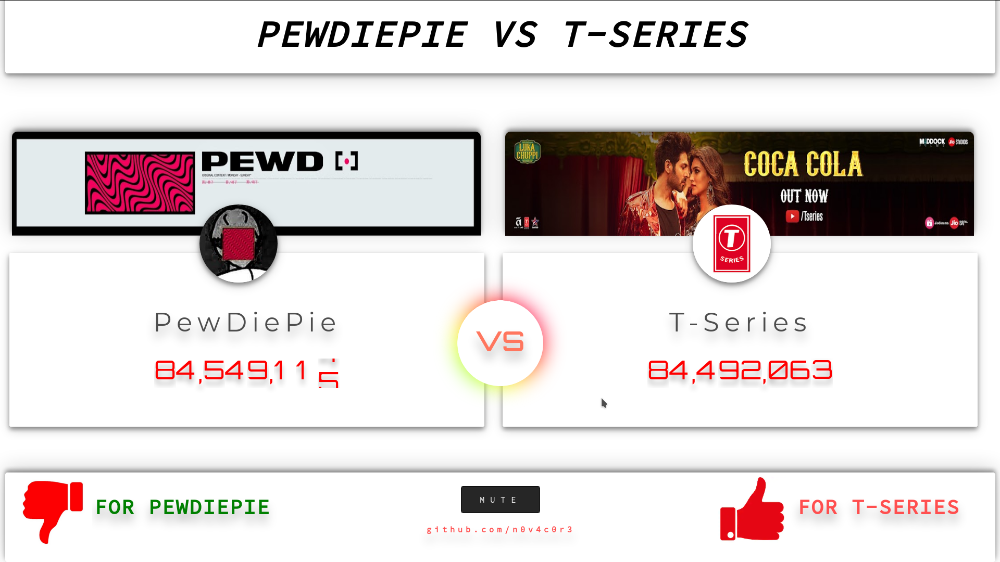

## YouTube Browser Subscriber Counter

This is a simple YouTube Subscriber Counter which shows the current live subscriber count of a YouTube Channel.Calculated count is often incorrect sometime.Subscriber Counts are taken Directly from the YouTube API.

This page is simple and clean.

 * Default comparison is between PewDiePie VS T-series
 * Default song [Bitch Lasagna (Party In Backyard)](https://www.youtube.com/watch?v=6Dh-RL__uN4) and [Bye Pewdiepie | Carryminati](https://www.youtube.com/watch?v=2QBsDH72MoM) added

## Features

 * Realtime Subscriber count
 * Realtime comparison
 * Simple ui
 * Refress in every Two seconds
 * Added Mute/Unmute button
 * Rolling transition animation for counting
 * Gradient Transition effect
 * Simple JS and Css only

## Add Another Channel
 * edit [main.js](assets/js/main.js) to add custom channel 

## Screenshot

 
 
 
 ## License

 You may freely modify the code for personal use.
 
## ~N0v4c0r3
